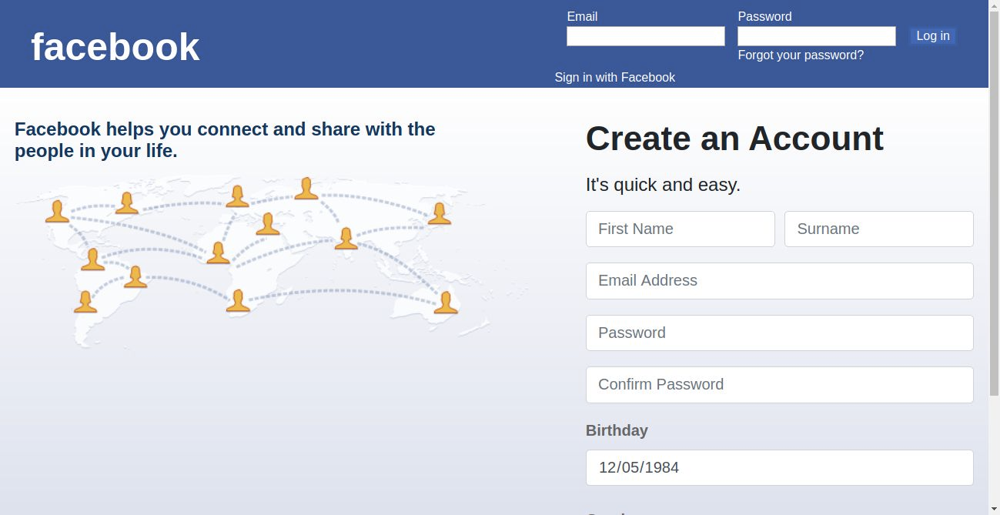
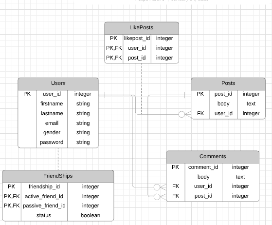

<<<<<<< HEAD
# facebook_clone
A facebook-like social network application
=======
# FACEBOOK CLONE

This project is a Facebook-like social network application built with rails.

## Table of Contents

* [About the Project](#about-the-project)
  * [Built With](#built-with)
* [Live Preview](#live-preview)
* [Data Architecture Documentation (ERD)](#data-architecture-documentation-(ERD))
* [Required Installations](#required-installations)
* [Instalation of This App](#instalation)
* [License](#license)
* [Contact](#contact)
* [Acknowledgements](#acknowledgements)


<!-- ABOUT THE PROJECT -->
## About The Project

This project requests you to build a Facebook-like social network application.

Full task description: <a href="https://www.theodinproject.com/courses/ruby-on-rails/lessons/final-project"> Odin Project.</a>

### Built With 

* HTML
* CSS
* Git
* Ruby
* Ruby on Rails

## Live Preview

This is the link to the live preview in Heroku. Feel free to visit.<br>
<a href="">Private Events</a> <br>
<p>Below is the HomePage Screenshot</p>


## Data Architecture Documentation (ERD)
The image below is a copy of the Entity Relationship Diagram generated for this project.
<br>

<<<<<<< HEAD


## Required Installations

<p>If you want a copy of this project running on your machine you have to install:</p>

* Ruby 2.6.4
* Gem 3.0.3
* Rails 6.0.2
* Bundler 2.0.2

<a href="https://www.tutorialspoint.com/ruby-on-rails/rails-installation"> Installation Instructions</a>

<!-- INSTALATION -->
## Instalation of This App

Once you have installed the requiered packages shown on the [Required Installations](#required-installations), proceed with the following steps

Clone the Repository,

```Shell
your@pc:~$ git clone https://github.com/adaorachi/facebook_clone
```

Move to the downloaded folder

```Shell
your@pc:~$ cd facebook_clone
```

install gems

```Shell
your@pc:~$ bundle install --without production
```

migrate and seed the database

```Shell
your@pc:~$ rails db:migrate
```

```Shell
your@pc:~$ rails db:seed
```

Run the app in a local server:

```Shell
your@pc:~$ rails server
```

Then, go to [http://localhost:3000](http://localhost:3000)

<!-- LICENSE -->
## License

Distributed under the MIT License. See `LICENSE` for more information.

<!-- CONTACT -->
## Contact
* Felipe Enne - felipeenne@gmail.com | [Github Account https://github.com/FelipeEnne](https://github.com/FelipeEnne)
* MaryAnn Chukwuka - annychuks07@gmail.com | [Github Account https://github.com/adaorachi](https://github.com/adaorachi)

<!-- ACKNOWLEDGEMENTS -->
## Acknowledgements

* <a href="https://www.microverse.org/"> Microverse</a>  and <a href="https://www.theodinproject.com/"> Odin Project</a> .
=======
>>>>>>> development
>>>>>>> b96ec9a0b4d8ee584c80f27700873f60695cc6d2
