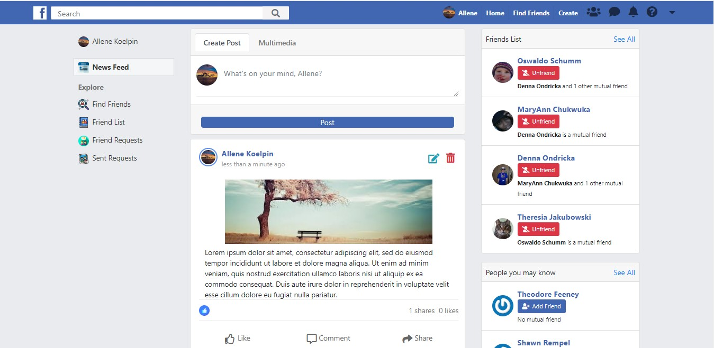

# FACEBOOK CLONE

This project is a Facebook-like social network application built with rails. It implements the basic functionality found on the popular social media app called Facebook.

## Table of Contents

* [About the Project](#about-the-project)
  * [Built With](#built-with)
* [Live Preview](#live-preview)
* [Data Architecture Documentation (ERD)](#data-architecture-documentation)
* [Required Installations](#required-installations)
* [Installation of This App](#installation)
* [License](#license)
* [Contact](#contact)
* [Acknowledgements](#acknowledgements)


<!-- ABOUT THE PROJECT -->
## About The Project

This project is a Facebook-like social network application. In this project, users can sign up either through the app or with their Facebook account. Once a user becomes a member, such user can be able to create posts and comments on other posts and in which only his/her friends can see and view. A user can also be able to post images too. A user can friend or unfriend a user. The main goal is to put in practice the main concepts of Model Associations, Session Authentications with devise gem, and units & integration testing with RSpec and Capybara.

Full task description: <a href="https://www.theodinproject.com/courses/ruby-on-rails/lessons/final-project"> Odin Project.</a>

<!-- BUILT WITH -->
### Built With 

* HTML
* CSS
* Git
* Ruby
* Ruby on Rails

<!-- LIVE PREVIEW -->
## Live Preview

This is the link to the live preview in Heroku. Feel free to visit.<br>
<a href="https://still-plateau-86976.herokuapp.com">FaceBook Clone</a> <br>
<p>Below is the HomePage Screenshot</p>


### How to login as a user
This enables users to log in to the app to test the application themselves.
username: example-3@railstutorial.org
password: password


## Features

* Users can signup and send friend requests to other users.
* Posts are created by users and only a user's friend can view or see them.
* User can comment can on his/her post or other users' posts.
* Users can like posts and comments.
* Users can search for other users with the search input by their names.

<!-- ERD -->
## Data Architecture Documentation (ERD)
The image below is a copy of the Entity Relationship Diagram generated for this project.
<br>


<!-- REQUIRED INSTALLATION -->
## Required Installations

<p>If you want a copy of this project running on your machine you have to install:</p>

* Ruby 2.6.4
* Gem 3.0.3
* Rails 6.0.2
* Bundler 2.0.2
* Rspec

<a href="https://www.tutorialspoint.com/ruby-on-rails/rails-installation"> Installation Instructions</a>

<!-- INSTALLATION -->
## Installation of This App

Once you have installed the required packages shown on the [Required Installations](#required-installations), proceed with the following steps

Clone the Repository,

```Shell
your@pc:~$ git clone https://github.com/adaorachi/facebook_clone
```

Move to the downloaded folder

```Shell
your@pc:~$ cd facebook_clone
```

install gems

```Shell
your@pc:~$ bundle install --without production
```

migrate and seed the database

```Shell
your@pc:~$ rails db:migrate
```

```Shell
your@pc:~$ rails db:seed
```

Run the app in a local server:

```Shell
your@pc:~$ rails server
```

Then, go to [http://localhost:3000](http://localhost:3000)

## Test Run

To run the unit test, follow these steps.

Open a terminal

Install the rspec gem if you have not already

```Shell
your@pc:~$ gem install rspec
```

Run RSpec in the terminal

```Shell
your@pc:~$ rspec
```

## Future Features

Some of the features or improvements we would like to implement on this project is to make the views responsive and also add more unit test to the test suite.

<!-- LICENSE -->
## License

Distributed under the MIT License. See `LICENSE` for more information.

<!-- CONTACT -->
## Contact
* Felipe Enne - felipeenne@gmail.com | [Github Account https://github.com/FelipeEnne](https://github.com/FelipeEnne)
* MaryAnn Chukwuka - annychuks07@gmail.com | [Github Account https://github.com/adaorachi](https://github.com/adaorachi)

<!-- ACKNOWLEDGEMENTS -->
## Acknowledgements

* <a href="https://www.microverse.org/"> Microverse</a>  and <a href="https://www.theodinproject.com/"> Odin Project</a> .
